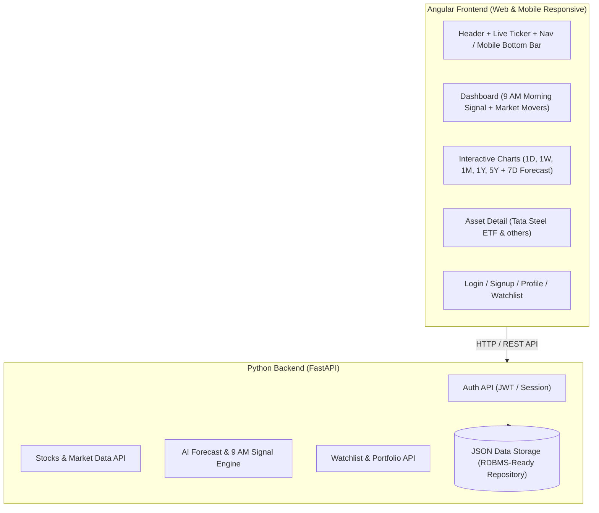

# TradeAI Phase 1: Core Architecture & AI Pre-Market Forecasting Platform Plan

## Overview
TradeAI is a full-stack financial technology application that predicts future trading graphs for the upcoming week and delivers automated actionable BUY/SELL signals every morning before 9:00 AM for stocks and ETFs (e.g., Tata Steel ETF / TATASIL, NIFTY 50, Reliance, etc.).

## System Architecture

---

## Deliverables & Modules

### 1. Python FastAPI Backend (`backend/`)
- **FastAPI Core Gateway (`main.py`)**: CORS middleware, life-cycle hooks, and modular routers.
- **Data Models (`models.py`)**: Pydantic schemas for Stock, PricePoint, ForecastResult, MorningSignal, Watchlist, Portfolio, and User.
- **Data Repository Layer (`data_store.py`)**: Multi-timeframe historical datasets (1D intraday 5-min intervals, 1W hourly, 1M daily, 1Y weekly, 5Y monthly) for Indian and US assets (`TATASIL`, `NIFTY50`, `RELIANCE`, `TCS`, `AAPL`, `TSLA`, `GOLDBEES`, `SILVERBEES`).
- **Forecasting & 9 AM Signal Engine (`forecast_engine.py`)**:
  - Google TimesFM 3.0 foundation model zero-shot numerical forecasting with 10%, 50%, and 90% quantile predictions.
  - Pre-market technical indicators: RSI(14), SMA(20), SMA(50), MACD, and volatility metrics.
  - 9:00 AM daily BUY/SELL/HOLD decision algorithms with confidence ratings, target prices, stop-loss channels, and catalytic drivers.
- **Modular Routers (`routers/`)**:
  - `stocks.py`: Monitored assets catalog, historical charts, ticker search.
  - `forecast.py`: 7-day prediction trajectories and morning signal digests.
  - `portfolio.py`: Simulated paper trading orders and watchlist management.
  - `auth.py`: User authentication, profile settings, and session persistence.

### 2. Angular 22 Cyber-Financial Frontend (`frontend/`)
- **Design System & Aesthetics**: Cyberpunk FinTech dark theme with glowing neon accents, glassmorphic panels, and Google Fonts typography.
- **Interactive Multi-Timeframe Chart (`trading-chart.component.ts`)**: Candlestick & Area Line rendering with 7-day AI forecast overlay and live RSI gauge.
- **Morning Signal Cards (`morning-signal-card.component.ts`)**: 9:00 AM pre-market cards with action tags (`STRONG BUY`, `BUY`, `HOLD`, `SELL`), confidence ratings, and quick simulation buttons.
- **Tata Steel ETF Spotlight (`stock-detail.component.ts`)**: Deep-dive analytics, forecast trajectory table, and 1-click order simulation.
- **Dashboard (`dashboard.component.ts`)**: 9:00 AM Pre-Market daily digest banner, spotlight ticker, signal feeds, and filterable asset tables.
- **Search Modal (`search-modal.component.ts`)**: Global `Ctrl + K` instant lookup.
