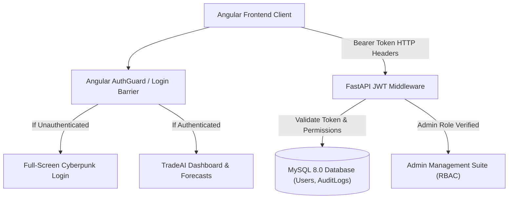

# TradeAI Phase 2: JWT Authentication, MySQL DB Persistence & Admin RBAC Plan

## Overview
Secure the TradeAI application by implementing JWT Bearer authentication, replacing purely transient data with relational MySQL 8.0 storage, creating a comprehensive database schema with auto-provisioned default accounts, introducing an Admin Control Panel with Role-Based Access Control (RBAC), and establishing a full-screen login barrier for unauthenticated visitors.

---

## Deliverables & Architecture

---

## Key Modules & Changes

### 1. MySQL Database Architecture (`backend/`)
- **Database Engine (`database.py`)**:
  - Configured SQLAlchemy engine and sessionmaker supporting MySQL 8.0 via `pymysql` driver with fallback connection strings.
- **SQLAlchemy DB Models (`db_models.py`)**:
  - `UserDB`: `id`, `username`, `email`, `hashed_password`, `full_name`, `role` (`admin` / `user`), `is_active`, `created_at`, `last_login_at`.
  - `AuditLogDB`: `id`, `user_id`, `action`, `ip_address`, `details`, `timestamp`.
- **Database Schema DDL (`schema.sql`)**:
  - Clean SQL schema for fresh installations with tables, indexes, constraints, and default seeded accounts:
    - `admin` / `admin123` (Role: `admin`)
    - `trader_pro` / `password123` (Role: `user`)
- **Database Seeder (`init_db.py`)**:
  - Script to verify and initialize database tables and seed accounts.

### 2. JWT Security Layer (`backend/auth_utils.py`)
- Password hashing using `bcrypt` (with standard salt generation).
- JWT encoding and decoding using `PyJWT` with 24-hour expiration (`ACCESS_TOKEN_EXPIRE_MINUTES=1440`).
- FastAPI dependency injection (`get_current_user`, `require_admin`).
- Rate limiting and audit logging hooks.

### 3. Protected Backend REST API (`backend/routers/auth.py`)
- `POST /api/auth/login`: Authenticates credentials, generates JWT access token, and records login timestamp.
- `POST /api/auth/register`: Public registration for new traders with `user` role.
- `GET /api/auth/me`: Validates JWT token and returns authenticated user profile.
- `GET /api/auth/admin/users`: Admin-only endpoint returning paginated system user list with roles and statuses.
- `PUT /api/auth/admin/users/{user_id}/status`: Admin-only account activation / suspension.
- `PUT /api/auth/admin/users/{user_id}/role`: Admin-only promotion/demotion between `admin` and `user`.

### 4. Angular Security & Admin Management (`frontend/`)
- **Full-Screen Login Barrier (`auth-modal.component.ts`)**: Full-screen modal overlay preventing unauthenticated interaction with animated cybersecurity aesthetics and seamless login/signup switching.
- **Admin Management Panel (`admin-panel.component.ts`)**:
  - Overview cards: Total Users, Active Users, Admin Accounts, System Health.
  - Interactive User Table: Search filter, role tags (`ADMIN`, `TRADER`), status indicators, 1-click status toggle button, and role change modal.
- **Route Guards & HTTP Interceptors**:
  - `auth.guard.ts`: Enforces authentication on private routes and restricts `/admin` strictly to users with `role === 'admin'`.
  - Token injection in API client headers.
