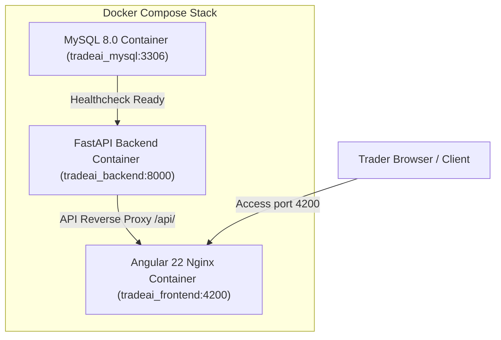

# TradeAI Phase 4: Active Agent Indicator, Dockerization, Test Suite & Documentation Plan

## Overview
Provide real-time active agent visual progression on the frontend, full Docker Compose multi-container deployment for the entire stack, automated cross-platform test runner scripts, and complete documentation with configuration guide and default provisioned credentials.

---

## Deliverables & Architecture

---

## Key Modules & Changes

### 1. Frontend Real-Time Active Agent Indicator
- **MultiAgentPanelComponent (`multi-agent-panel.component.ts`)**:
  - **Active Agent Execution Beacon**: Top glowing banner with neon blue radar pulse animation highlighting the exact agent currently running during synthesis.
  - **Dynamic Step States**:
    - `ACTIVE / WORKING`: Glowing neon blue border, spinning indicator ring, active agent description.
    - `DONE / COMPLETED`: Green border, checkmark icon `✓`, execution latency chip.
    - `WAITING / PENDING`: Dimmed opacity (0.45) for queued stages.

### 2. Full-Stack Docker Containerization
- **Backend Dockerfile (`Dockerfile.backend`)**:
  - Base: `python:3.12-slim`
  - System build dependencies and `pip` installation from `backend/requirements.txt`.
  - HuggingFace model cache volume (`/root/.cache/huggingface`) to persist TimesFM model weights between container restarts.
  - Exposes port `8000`.
- **Frontend Dockerfile (`Dockerfile.frontend`)**:
  - Multi-stage build with `node:22-alpine` building Angular production bundle.
  - Lightweight `nginx:alpine` image serving compiled SPA assets with gzip compression on port `4200`.
- **Nginx Configuration (`nginx.conf`)**:
  - SPA routing fallback (`try_files $uri $uri/ /index.html`).
  - Reverse proxy forwarding `/api/` traffic directly to `http://backend:8000/api/`.
- **Docker Compose Orchestrator (`docker-compose.yml`)**:
  - Coordinates `db` (MySQL 8.0), `backend` (FastAPI), and `frontend` (Angular Nginx).
  - Automatically initializes database with `backend/schema.sql`.
- **Docker Build Context Optimization (`.dockerignore`)**:
  - Excludes `node_modules`, `.venv`, `.git`, `.pytest_cache`, and temporary log files.

### 3. Automated Test Suite & Execution Scripts
- **Windows Test Runner (`run_tests.bat`)**:
  - Automated batch script executing full backend pytest suite followed by frontend production build verification.
- **Linux/macOS Test Runner (`run_tests.sh`)**:
  - Cross-platform bash script for CI/CD test automation.
- **Backend Dependency Specification (`backend/requirements.txt`)**:
  - Pinned versions for `fastapi`, `uvicorn`, `torch`, `timesfm`, `google-genai`, `yfinance`, `sqlalchemy`, `pymysql`, `cryptography`, `pyjwt`, and `pytest`.

### 4. Comprehensive Documentation
- **Configuration & Installation Guide (`INSTALLATION_AND_SETUP.md`)**:
  - One-click Docker Compose setup vs. manual local development.
  - Environment variables reference table (`MYSQL_*`, `JWT_SECRET_KEY`, `GEMINI_API_KEY`).
  - Default provisioned credentials table (`admin` / `admin123`, `trader_pro` / `password123`).
- **Comprehensive Readme (`README.md`)**:
  - Complete architecture diagrams, feature breakdown, 6-agent workflow explanations, API catalog, and quickstart commands.
